# Tutorial: Online Migration of Azure Database for PostgreSQL - Single Server to Flexible Server using the Azure Portal

You can perform Online migration of an instance of Azure Database for PostgreSQL – Single Server to Azure Database for PostgreSQL – Flexible Server by using the Azure Portal. In this tutorial, we perform Online migration of a sample database from an Azure Database for PostgreSQL single server to a PostgreSQL flexible server using the Azure Portal.

>[!NOTE]
> The Online migration mode is in preview.

In this tutorial, you learn about:

> [!div class="checklist"]
>
> * Prerequisites
> * Configure the migration task
> * Monitor the migration
> * Cancel the migration
> * Migration best practices

## Prerequisites

To complete this tutorial, you need to:

* Use an existing instance of Azure Database for PostgreSQL – Single Server (the source server)
* All extensions used on the Single Server (source) must be [allow-listed on the Flexible Server (target)](https://learn.microsoft.com/azure/postgresql/migrate/concepts-single-to-flexible#allow-list-required-extensions)

> [!IMPORTANT]
> To provide the best migration experience, performing migration using a burstable instance of Flexible server is not supported. Please use a general purpose or a memory optimized instance (4 VCore or higher) as your Target Flexible server to perform the migration. Once the migration is complete, you can downscale back to a burstable instance if necessary.

1. Create the target flexible server. For guided steps, refer to the quickstart [Create an Azure Database for PostgreSQL flexible server using the Portal](https://learn.microsoft.com/azure/postgresql/flexible-server/quickstart-create-server-portal)

2. Allowlist all required extensions as shown in [Migrate from Azure Database for PostgreSQL Single Server to Flexible Server](https://learn.microsoft.com/azure/postgresql/migrate/concepts-single-to-flexible#allow-list-required-extensions). It is important to allowlist the extensions before you initiate a migration using this tool.

Video:

> [!VIDEO https://github.com/hariramt/Single2FlexibleOnline/blob/main/media/S2F-Portal-migration.mp4]

<video src="https://github.com/hariramt/Single2FlexibleOnline/blob/main/media/S2F-Portal-migration.mp4"></video>

## Configure the migration task

The migration tool comes with a simple, wizard-based experience on the Azure portal. Here's how to start:

1. Open your web browser and go to the [portal](https://portal.azure.com/). Enter your credentials to sign in. The default view is your service dashboard.

2. Go to your Azure Database for PostgreSQL Flexible Server target.

3. In the **Overview** tab of the Flexible Server, on the left menu, scroll down to **Migration (preview)** and select it.

    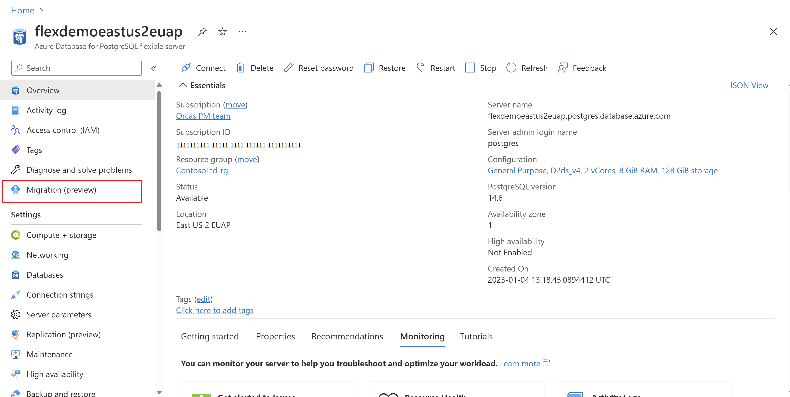

4. Select the **Migrate from Single Server** button to start a migration from Single Server to Flexible Server. If this is the first time you're using the migration tool, an empty grid appears with a prompt to begin your first migration.

    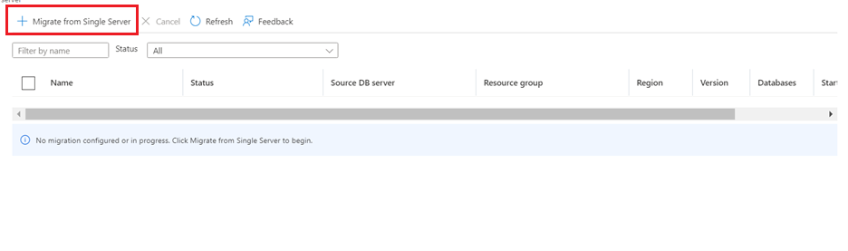

    If you've already created migrations to your Flexible Server target, the grid contains information about migrations that were attempted to this target from any Single Server(s).

5. Select the **Migrate from Single Server** button. You go through a wizard-based series of tabs to create a migration into this Flexible Server target from any source Single Server.

Alternatively, you can initiate the migration process from the Azure Database for PostgreSQL Single Server.

1. Open your web browser and go to the [portal](https://portal.azure.com/). Enter your credentials to sign in. The default view is your service dashboard.

2. Upon selecting the Single Server, you can observe a migration-related banner in the Overview tab. Select **Migrate now** to get started.

    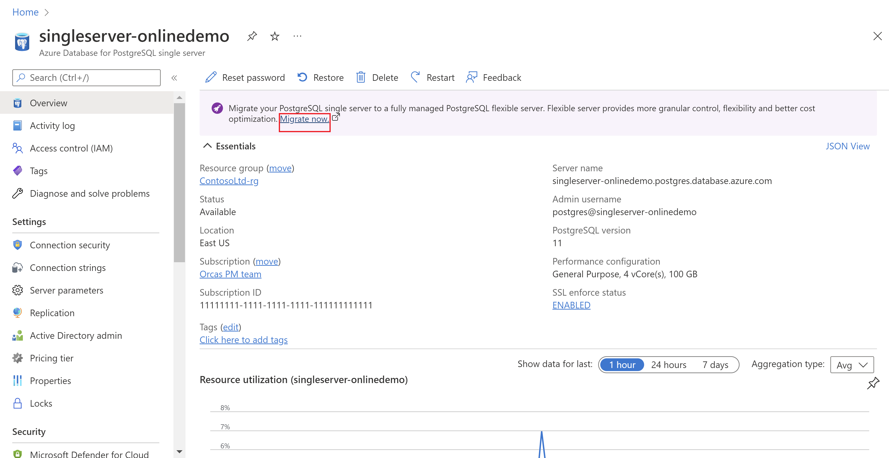

3. You're taken to a page with two options. If you've already created a Flexible Server and want to use that as the target, choose **Select existing**, and select the corresponding Subscription, Resource group and Server name details. Once the selections are made, select **Go to Migration wizard** and skip to the instructions under the **Setup tab** section in this page.

    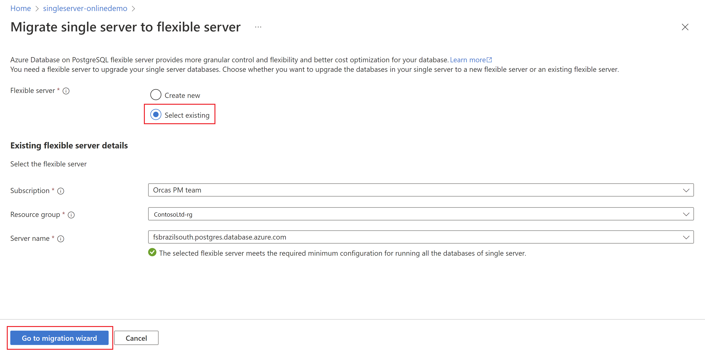

4. Should you choose to Create a new Flexible Server, select **Create new** and select **Go to Create Wizard**. This action takes you through the Flexible Server creation process and deploys the Flexible Server.

    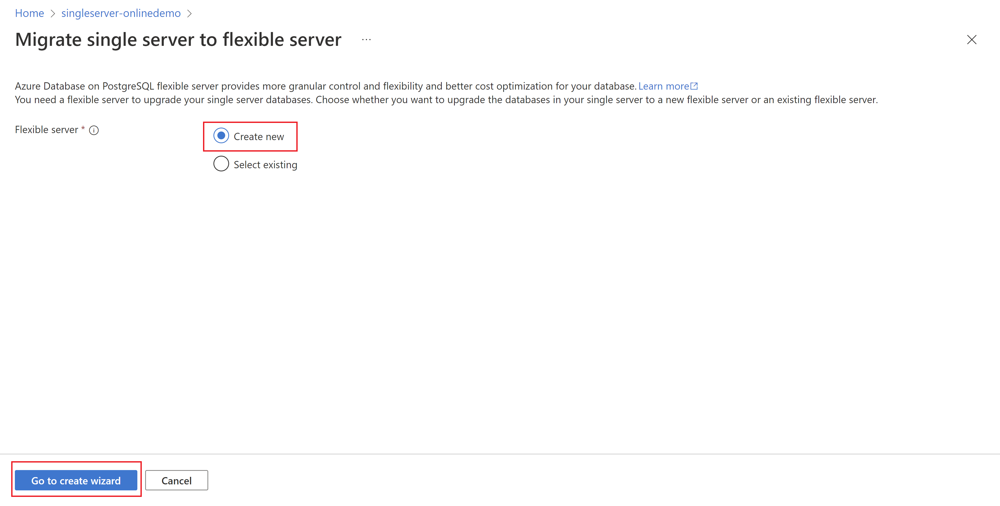

After deploying the Flexible Server, follow the steps 3 to 5 under [Configure the migration task](#configure-the-migration-task)

### Setup tab

The first tab is **Setup**. Just in case you missed it, allowlist all required extensions as shown in [Migrate from Azure Database for PostgreSQL Single Server to Flexible Server](https://learn.microsoft.com/azure/postgresql/migrate/concepts-single-to-flexible#allow-list-required-extensions). It is important to allowlist the extensions before you initiate a migration using this tool.

>[!NOTE]
> If TIMESCALEDB, PG_PARTMAN, POSTGRES_FDW or POSTGIS_TIGER_DECODER extensions are used in your single server database, please raise a support request since the Single to Flex migration tool will not handle these extensions.

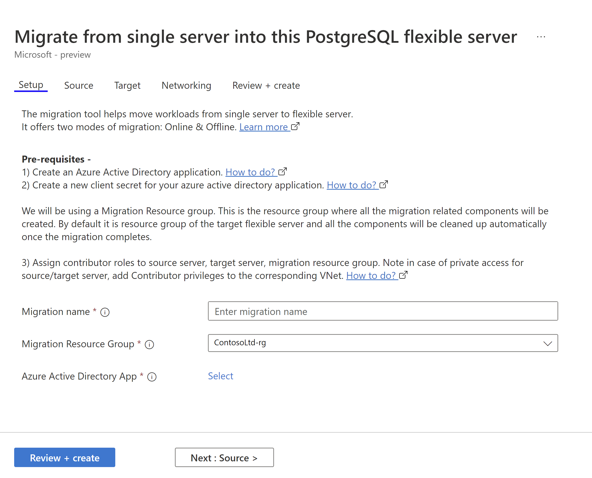

In the Setup tab, you have to enter a name for the Migration task. **Migration name** is the unique identifier for each migration to this Flexible Server target. This field accepts only alphanumeric characters and doesn't accept any special characters except a hyphen (-). The name can't start with a hyphen and should be unique for a target server. No two migrations to the same Flexible Server target can have the same name.

Select the **Next** button.

### Source tab

The **Source** tab prompts you to give details related to the Single Server that is the source of the databases.

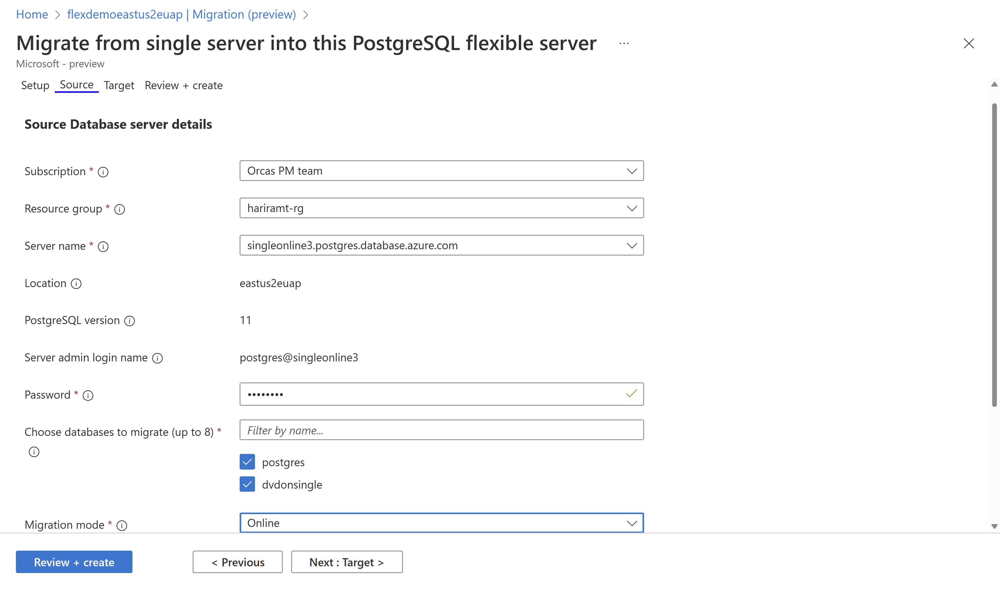

After you make the **Subscription** and  **Resource Group** selections, the dropdown list for server names shows Single Servers under that resource group across regions. Select the source that you want to migrate databases from. Note that you can migrate databases from a Single Server to a target Flexible Server in the same region - cross region migrations aren't supported.

After you choose the Single Server source, the **Location**, **PostgreSQL version**, and **Server admin login name** boxes are populated automatically. The server admin login name is the admin username used to create the Single Server. In the **Password** box, enter the password for that admin user. The migration tool performs the migration of single server databases as the admin user.

Under **Choose databases to migrate**, there's a list of user databases inside the Single Server. You can select and migrate up to eight databases in a single migration attempt. If there are more than eight user databases, the migration process is repeated between the source and target servers for the next set of databases.

The final property on the **Source** tab is **Migration mode**. The migration tool offers offline mode of migration as default. Online mode is also supported.

After filling out all the fields, select the **Next** button.

### Target tab

The **Target** tab displays metadata for the Flexible Server target, like subscription name, resource group, server name, location, and PostgreSQL version. 

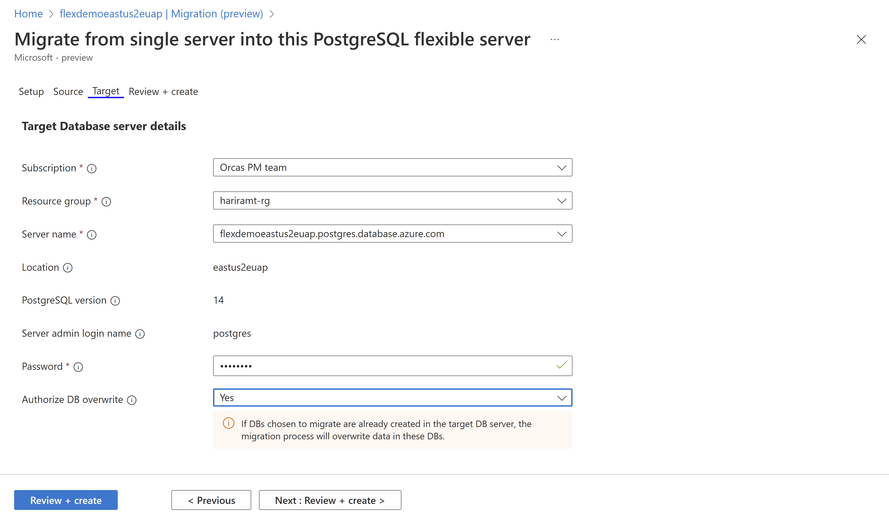

For **Server admin login name**, the tab displays the admin username used during the creation of the Flexible Server target. Enter the corresponding password for the admin user.

For **Authorize DB overwrite**:

- If you select **Yes**, you give this migration tool permission to overwrite any databases with the same name that is already present at the target.
- If you select **No**, the migration tool does not overwrite any databases at the target.

Select the **Next** button.

### Review + create tab

>[!NOTE]
> Gentle reminder to allowlist the [extensions](https://learn.microsoft.com/azure/postgresql/migrate/concepts-single-to-flexible#allow-list-required-extensions) before you select **Create** in case it is not yet complete.

The **Review + create** tab summarizes all the details for creating the migration. Review the details and select the **Create** button to start the migration.

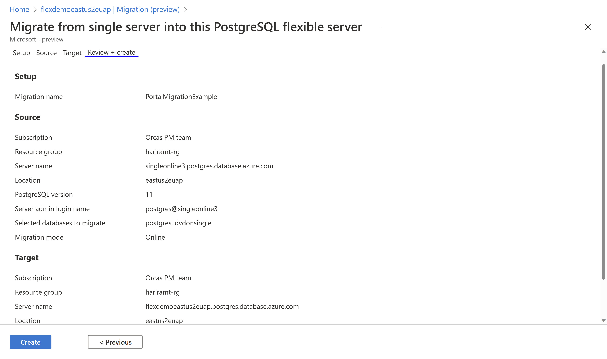

## Monitor the migration

After you select the **Create** button, a notification appears in a few seconds to say that the migration creation is successful. You are redirected automatically to the **Migration (Preview)** page of Flexible Server. That page has a new entry for the recently created migration.

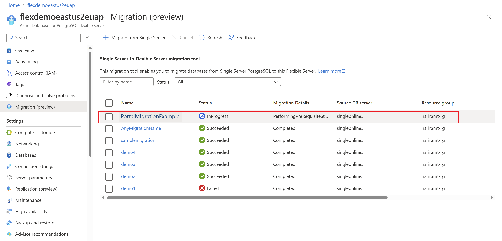

The migrations are in the descending order of migration start time with the most recent migration on top.You can use the refresh button to refresh the status of the migrations.
Select the migration name in the grid to see the details of that migration.
As soon as the migration is created, the migration moves to the **InProgress** state and **PerformingPreRequisiteSteps** substate. It takes 2-3 minutes for the migration workflow to set up the migration infrastructure and network connections.

If **Online migration** is selected, it requires **Logical replication** to be turned on in the source Single server. If it is not turned on, the migration tool automatically turns on logical replication at the source Single server. Note that this action will restart the source single server.

After the **PerformingPreRequisiteSteps** substate is completed, the migration moves to the substate of **Migrating Data** when the Cloning/Copying of the databases takes place. The time for migration to complete depends on the size and shape of databases that you are migrating. If the data is mostly evenly distributed across all the tables, the migration is quick. Skewed table sizes take a relatively longer time.

When you select each of the databases in migration, a fan-out pane appears. It has all the table count - copied, queued, copying and errors apart from the database migration status.

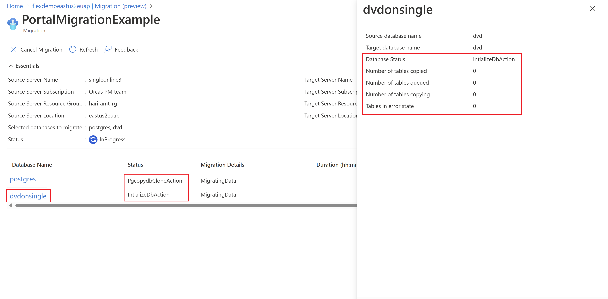

The migration moves to the **Succeeded** state as soon as the **Migrating Data** state finishes successfully. In case of Online migration, a **cutover** action is required from the user. After the copy/clone of the base data is complete, the migration moves to `WaitingForUserAction` state and `WaitingForCutoverTrigger` substate. In this state, user can trigger cutover from the portal by selecting the migration.

Before initiating cutover it is important to ensure that:
- Writes to the source are stopped
-`Latency (minutes)` parameter is 0 or close to 0

`Latency (minutes)` parameter indicates when the target last synced up with the source. For example, here it is 2 and 2.016666 for the two databases as shown in the picture below, it means that the changes that have occurred in the last ~2 minutes at the source are yet to be synced to the target. At this point, writes to the source can be stopped and cutover initiated. In case there is heavy traffic at the source, it is recommended to stop writes first so that `Latency (minutes)` can come close to 0 and then cutover is initiated. The Cutover operation applies all pending changes from the Source to the Target and completes the migration. If you trigger a "Cutover" even with non-zero `Latency`, the replication will not stop immediately. Cutover will finish once all the data on source until the cutover point is applied on the target. Say a latency was 15 minutes at cutover point, so all the change data in the last 15 minutes will be applied on the target. Time taken will depend on the backlog of changes occurred in the last 15 minutes. Hence, it is recommended that the latency goes to zero or near zero, before triggering the cutover. 
The `Latency (minutes)` information can be obtained from the migration details screen as shown below:

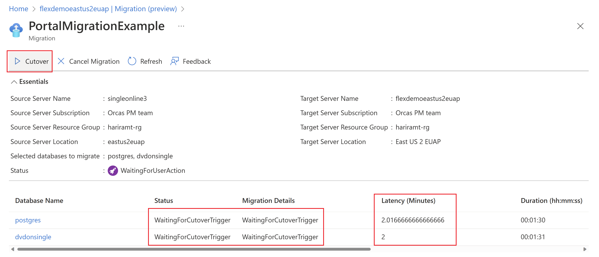

The migration moves to the `Succeeded` state as soon as the `Migrating Data` substate or the cutover (in case of Online migration) finishes successfully. If there's a problem at the `Migrating Data` substate, the migration moves into a `Failed` state.

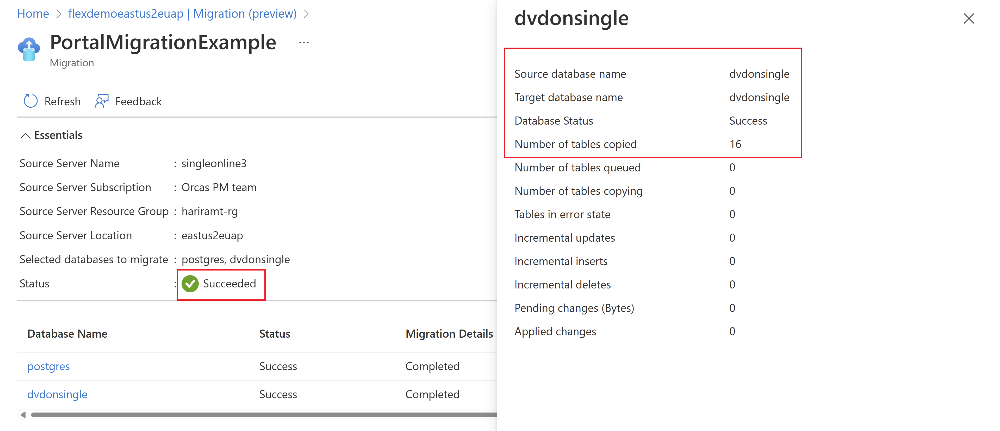

Once the migration moves to the **Succeeded** state, migration of schema and data from your Single Server to your Flexible Server target is complete. You can use the refresh button on the page to confirm the same.

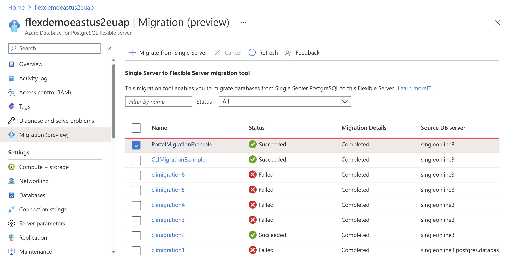

After the migration has moved to the **Succeeded** state, follow the post-migration steps in [Migrate from Azure Database for PostgreSQL Single Server to Flexible Server](https://learn.microsoft.com/azure/postgresql/migrate/concepts-single-to-flexible#post-migration).

The following tables describe the migration states and substates.

| Migration state | Description |
| ---- | ---- |
| `InProgress` | The migration infrastructure is set up, or the actual data migration is in progress. |
| `WaitingForUserAction` | The migration task is waiting for user input/action. |
| `Canceled` | The migration is cancelled or deleted. |
| `Failed` | The migration has failed. |
| `Succeeded` | The migration has succeeded and is complete. |

| Migration substate | Description |
| ----  | ---- |
| `PerformingPreRequisiteSteps` | Infrastructure is set up and is prepped for data migration. |
| `WaitingForCutoverTrigger` | The migration task is waiting for the user to cutover the migration so it can move to completed state. |
| `MigratingData` | Data migration is in progress. |
| `CompletingMigration` | Migration cutover is in progress. |
| `Completed` | Cutover was successful, and migration is complete. |

## Cancel the migration

You can cancel any ongoing migrations. To cancel a migration, it must be in the **InProgress** state. You can't cancel a migration that's in the **Succeeded** or **Failed** state.

You can choose multiple ongoing migrations at once and cancel them.
Cancelling a migration stops further migration activity on your target server. It doesn't drop or roll back any changes on your target server from the migration attempts. Be sure to drop the databases on your target server involved in a cancelled migration.

## Migration best practices

For a successful end-to-end migration, follow the post-migration steps in [Migrate from Azure Database for PostgreSQL Single Server to Flexible Server](https://learn.microsoft.com/azure/postgresql/migrate/concepts-single-to-flexible#best-practices). After you complete the preceding steps, you can change your application code to point database connection strings to Flexible Server. You can then start using the target as the primary database server.
